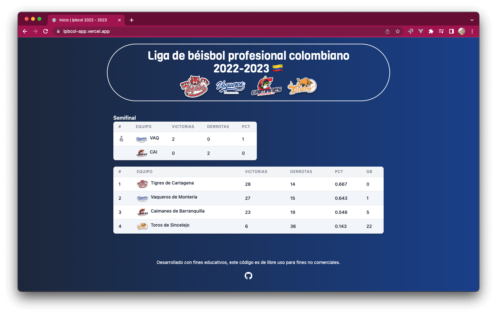

<h1 align="center">Welcome to lpbcol-app 👋</h1>
<p>
  
  <a href="#" target="_blank">
    
  </a>
  <a href="https://twitter.com/pipegoods" target="_blank">
    
  </a>
  
[](https://github.com/pipegoods/lpbcol-app/actions/workflows/deploy-api.yml)
[](https://github.com/pipegoods/lpbcol-app/actions/workflows/scrapping-lpbcol-website-data.yml)


</p>

> Web application with recent statistics of the Colombian professional baseball league, using scraping. Project made for educational purposes, nor for commercial use.



## API

Url: https://lpbcol.pipegoods.workers.dev/

endpoints:
- GET `/leaderboard`: Retorn leaderboard of league.
- GET `/teams`: Return all teams of league.
- GET `/teams/:id`: Return one team of league by id.

## Techs

Monorepo web project, the API is developed with [Hono](https://honojs.dev/) and to feed the database is used scraping the official site of the Colombian professional baseball league.

For the frontend we used [Astro](https://astro.build/) and [CSS Tailwind](https://tailwindcss.com/).

## Install

```sh
pnpm install
```

## Usage

```sh
pnpm run dev
```

## Author

👤 **Andres Vizcaino**

* Website: https://andresvizcaino.me/
* Twitter: [@pipegoods](https://twitter.com/pipegoods)
* Github: [@pipegoods](https://github.com/pipegoods)
* LinkedIn: [@andres-vizcaino-salazar](https://linkedin.com/in/andres-vizcaino-salazar)

## Show your support

Give a ⭐️ if this project helped you!

### inspiration

* midudev: [kings-league-project](https://github.com/midudev/kings-league-project)

***
_This README was generated with ❤️ by [readme-md-generator](https://github.com/kefranabg/readme-md-generator)_
